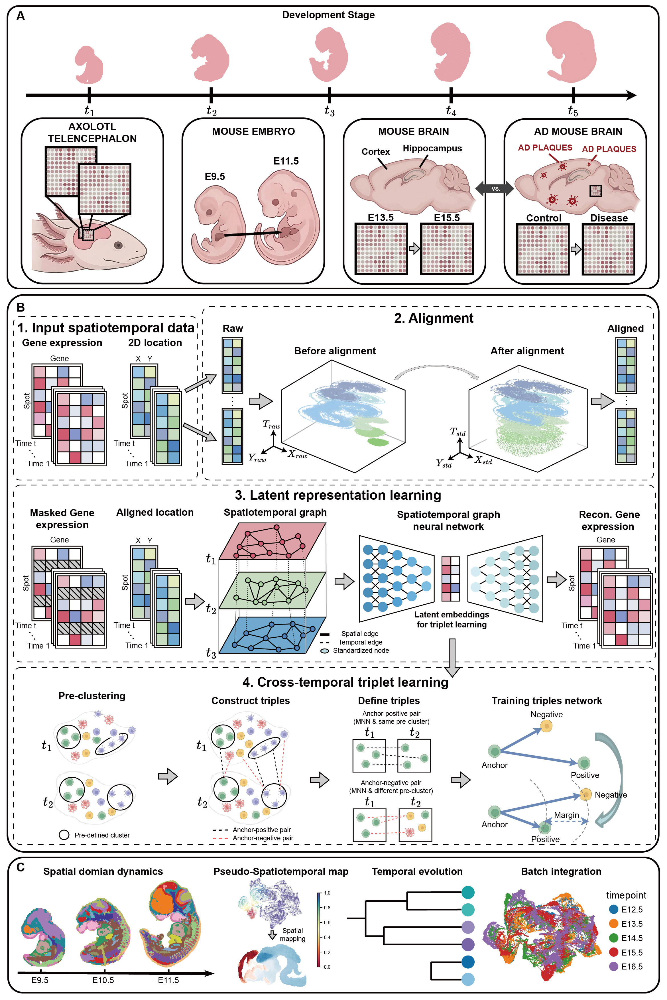

.. SpaTemporal documentation master file, created by
   sphinx-quickstart on Thu Jun  4 17:14:00 2026.
   You can adapt this file completely to your liking, but it should at least
   contain the root `toctree` directive.

SpaTemporal: a deep temporal-aware framework for the integration of spatiotemporal transcriptomics
=======================================

.. toctree::
   :maxdepth: 1

   Tutorial_Align_MOE
   Tutorial_Align_Axolotl
   Tutorial_Align_Alzheimer
   Tutorial_MOE
   Tutorial_MOB
   Tutorial_Axolotl
   Tutorial_Alzheimer

Overview of SpaTemporal
==================

**(A)** Representative spatiotemporal transcriptomics datasets across developmental stages and conditions, including axolotl telencephalon, mouse embryo development, mouse brain development, and mouse Alzheimer’s disease.
**(B)** Workflow of SpaTemporal.
1. Input gene expression and spatial coordinates from multiple time points.
2. Alignment of spatial coordinates into a shared reference to reduce morphological variation.
3. Latent representation learning via a spatiotemporal graph neural network that integrates spatial and temporal dependencies.
4. Cross-temporal triplet learning, where triplets are constructed in the latent space to enforce temporal consistency and improve representation discriminability.
**(C)** Downstream analyses, including spatial domain dynamics, pseudo-spatiotemporal mapping, temporal evolution inference, and multi-time-point data integration.

Installation
============
First clone the repository.

.. code-block:: python

   https://github.com/JinyunNiu/SpaTemporal.git
   cd SpaTemporal-main

It's recommended to create a separate conda environment for running STAligner:

.. code-block:: python

   #create an environment called SpaTemporal
   conda create -n SpaTemporal python=3.9

   #activate your environment
   conda activate SpaTemporal

Install all the required packages.

.. code-block:: python

   pip install -r requirements.txt

The torch-geometric library is used for building Graph Neural Networks. For a detailed installation process, you can refer to https://pytorch-geometric.readthedocs.io/en/latest/index.html, or refer to https://pytorch-geometric.com/whl/ for installation via offline wheels.

The rpy2 and mclust are used for mclust clustering. For installation details, please refer to https://pypi.org/project/rpy2/ and https://cran.r-project.org/web/packages/mclust/index.html.

The scikit-misc is used to support the data preprocessing part of Scanpy. However, version mismatches may cause errors during actual use. Please use the following code to install it:

.. code-block:: python

   pip install -i https://test.pypi.org/simple/ "scikit-misc==0.2.0rc1"

Install SpaTemporal.
	
.. code-block:: python

   python setup.py build
   python setup.py install

Citation
========
